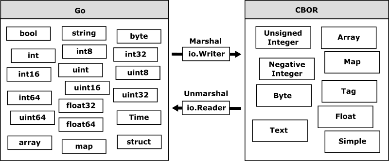
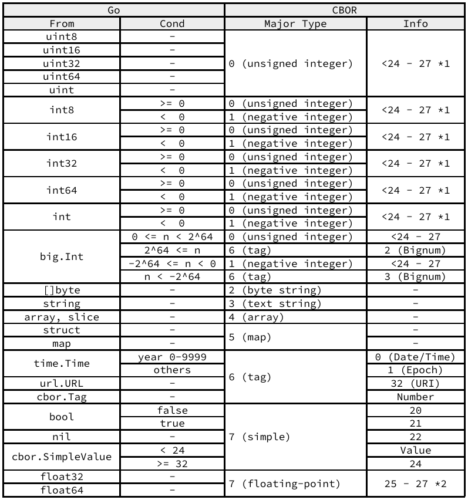
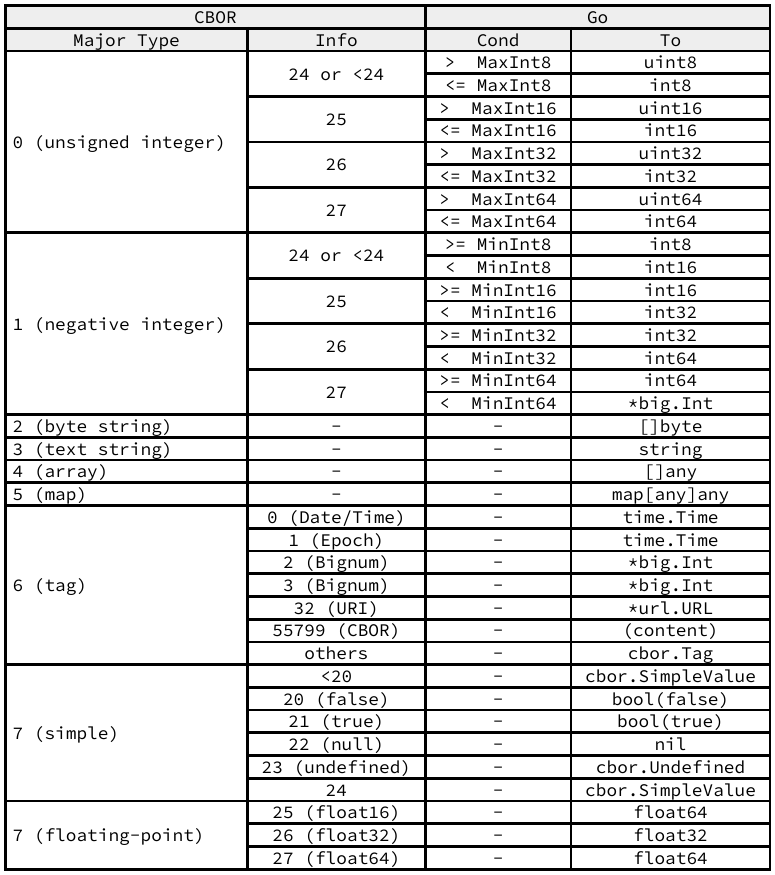
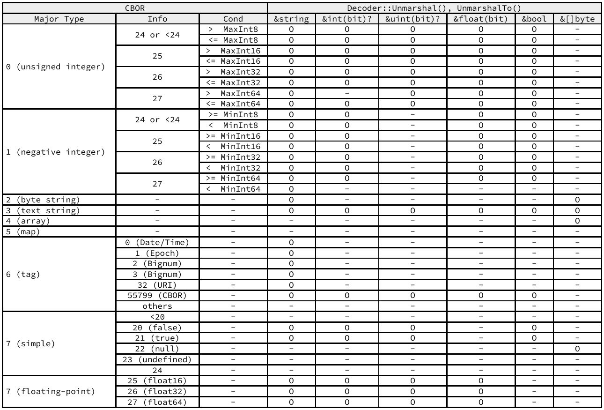
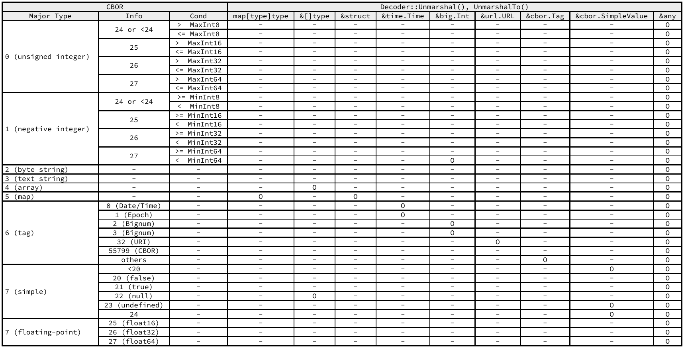

# go-cbor


[](https://github.com/cybergarage/go-cbor/actions/workflows/make.yml)
[](https://pkg.go.dev/github.com/cybergarage/go-cbor)
[](https://goreportcard.com/report/github.com/cybergarage/go-cbor)
[](https://codecov.io/gh/cybergarage/go-cbor)

`go-cobor` provides encoders and decoders for Concise Binary Object Representation (CBOR) binary representations. CBOR is defined in RFC8949, and it is a data format whose design goals include the possibility of extremely small code size, fairly small message size, and extensibility without the need for version negotiation.

`go-cobor` was developed as a seamless serializer for the memory representation of any data types in Go like `encodiong/json`. `go-cobor` provides the optimized encoder and decoder to convert between CBOR and Go data models easily.

By default, `go-cobor` encodes data items with the preferred serialization of RFC 8949 (Section 4.1), which uses the shortest form for integers, lengths, and floating-point values. Because the shortest form does not carry the Go type, decoded values may have a smaller Go type than the encoded ones, for example `int(1)` is decoded as `int8(1)`. `Unmarshal()` and `UnmarshalTo()` convert the decoded values to the destination types.

## Converting Data between Go and CBOR

`go-cobor` was developed as a seamless serializer for the memory representation of any data types in Go like `encodiong/json`. `go-cobor` provides the optimized encoder and decoder to convert between CBOR and Go data models easily.



### Encoding - Converting from Go to CBOR

`Decoder::Decode()` and `Marshal()` convert from the specified data model of Go into the equivalent data model of CBOR as the following.



To convert data from Go to CBOR, `go-cbor` offers `Marshal()`. `Marshal()` converts from the specified data model of Go into the equivalent data model of CBOR. In addition to the basic Go data types, `go-cbor` supports additional tag major types such as `time.Time` as the following.

- [Examples - Marshal](https://pkg.go.dev/github.com/cybergarage/go-cbor/cbor#example-Marshal)
```
goTimeObj, _ := time.Parse(time.RFC3339, "2013-03-21T20:04:00Z")
goObjs := []any{
    uint(1000),
    int(-1000),
    float32(100000.0),
    float64(-4.1),
    false,
    true,
    nil,
    []byte("IETF"),
    "IETF",
    goTimeObj,
    []int{1, 2, 3},
    map[any]any{"a": "A"},
    struct {
        Key   string
        Value string
    }{
        Key: "hello", Value: "world",
    },
}
for _, goObj := range goObjs {
    cborBytes, _ := cbor.Marshal(goObj)
    fmt.Printf("%s\n", hex.EncodeToString(cborBytes))
}
```

### Encode Modes

`Encoder` supports the following encode modes, which can be set with `Encoder::SetEncodeMode()`.

| Mode | Description |
|---|---|
| `EncodeModePreferred` (default) | Preferred serialization (RFC 8949 Section 4.1). Map keys are written in the Go map iteration order unless `MapSortEnabled` is set. |
| `EncodeModeCoreDeterministic` | Core deterministic encoding (RFC 8949 Section 4.2.1): the preferred serialization with map keys sorted in the bytewise lexicographic order of their encodings. |
| `EncodeModeLengthFirstDeterministic` | The preferred serialization with the length-first map key ordering (RFC 8949 Section 4.2.3, the canonical CBOR of RFC 7049). |
| `EncodeModeTypePreserving` | Encodes integers and floating-point values with the width of their Go types, so that decoded values keep the same width. This was the default behavior of v1.3.3 and earlier, and it does not satisfy the preferred serialization. |

```
var buf bytes.Buffer
encoder := cbor.NewEncoder(&buf)
encoder.SetEncodeMode(cbor.EncodeModeCoreDeterministic)
encoder.Encode(map[any]any{"b": 2, "a": 1})
// a2616101616202
```

`MapSortEnabled` sorts map keys in the bytewise lexicographic order of their encodings in `EncodeModePreferred` and `EncodeModeTypePreserving`.

### Indefinite-Length Encoding

To stream strings, arrays, and maps whose lengths are not known in advance, `Encoder` can write indefinite-length items (RFC 8949 Section 3.2). Between `StartIndefinite*()` and `EndIndefinite()`, each `Encode()` call writes a chunk of a string or an element of an array or a map (keys and values alternately). The deterministic encode modes do not allow indefinite-length items.

```
var buf bytes.Buffer
encoder := cbor.NewEncoder(&buf)
encoder.StartIndefiniteMap()
encoder.Encode("a")
encoder.Encode(1)
encoder.Encode("b")
encoder.StartIndefiniteArray()
encoder.Encode(2)
encoder.Encode(3)
encoder.EndIndefinite()
encoder.EndIndefinite()
// bf61610161629f0203ffff
```

### Converting between CBOR and JSON

`ToJSON()` and `FromJSON()` convert between CBOR and JSON as suggested in RFC 8949 Section 6. `Decoder::DecodeJSON()` and `Encoder::EncodeJSON()` do the same with the decoder and encoder configurations, such as `MaxNestedLevels` and `EncodeMode`.

```
jsonBytes, _ := cbor.ToJSON(cborBytes)
cborBytes, _ := cbor.FromJSON([]byte(`{"a":1,"b":[2,3.5]}`))
```

- CBOR to JSON (Section 6.1): integers keep all their digits, and floating-point values always have a fractional part or an exponent (for example `1.0`) so that they are converted back to floating-point values. NaN, infinities, `undefined`, and the other simple values become `null`. Byte strings become base64url strings, or base64 or base16 strings with tags 22 and 23. Bignums become base64url strings, with a `~` prefix for negative bignums. Other tags are ignored and their contents are converted. Map keys that are numbers, `false`, `true`, or `null` become strings such as `"1"`; other keys and keys that collide return `ErrJSON`.
- JSON to CBOR (Section 6.2): numbers without fractions or exponents become integers, or bignums beyond 64 bits; the other numbers become floating-point values in the shortest form. Object members keep their order unless map keys are sorted. Duplicate member names return `ErrJSON`.

### Decode Options

`Decoder` validates input as follows, which can be configured with the `Config` methods.

| Option | Default | Description |
|---|---|---|
| `SetDecodeMode()` | `DecodeModeLenient` | `DecodeModeCoreDeterministic` accepts only the core deterministic encoding (RFC 8949 Section 4.2.1) and rejects non-shortest arguments and floating-point values, indefinite-length items, unsorted or duplicate map keys, and non-preferred bignums. |
| `SetDuplicateMapKeyMode()` | `DuplicateMapKeyAllowed` | `DuplicateMapKeyRejected` returns `ErrDecode` for maps with duplicate keys (RFC 8949 Section 5.6). |
| `SetMaxNestedLevels()` | `128` | The maximum nesting depth of arrays, maps, and tags (RFC 8949 Section 10). |
| `SetUTF8ValidationEnabled()` | `true` | Validates text strings as UTF-8 when decoding and encoding (RFC 8949 Section 5.3.1). |

`Unmarshal()` and `UnmarshalTo()` decode a single data item and return `ErrDecode` if extraneous data follows it. Use `Decoder::Decode()` to read a sequence of data items.

### Decoding - Converting from CBOR to Go

`Decoder::Decode()` and `Unmarshal()` convert from the specified data model of CBOR into the equivalent data model of Go as the following.



To convert data from CBOR to Go, `go-cbor` offers `Unmarshal()`. `Unmarshal()` converts from an encoded bytes of CBOR into the equivalent data model of Go as the following.

- [Examples - Unmarshal](https://pkg.go.dev/github.com/cybergarage/go-cbor/cbor#example-Unmarshal)
```
cborObjs := []string{
    "0a",
    "1903e8",
    "3903e7",
    "fb3ff199999999999a",
    "f90001",
    "f4",
    "f5",
    "f6",
    "c074323031332d30332d32315432303a30343a30305a",
    "4449455446",
    "6449455446",
    "83010203",
    "a201020304",
}
for _, cborObj := range cborObjs {
    cborBytes, _ := hex.DecodeString(cborObj)
    goObj, _ := cbor.Unmarshal(cborBytes)
    fmt.Printf("%s => %v\n", cborObj, goObj)
}
```

### Unmarshaling from CBOR to Go

To unmarshal to a user-defined struct, `go-cbor` offers `Decoder::Unmarshal()` and `UnmarshalTo()`. The unmarshal functions try to convert from an encoded bytes of CBOR into the specified basic data types of Go as the following.



In addition to the basic standard data types of Go, The unmarshal functions support any user-defined maps and structs, as well as the standard struct such as time.Time as the following.



To unmarshal to a user-defined struct, `go-cbor` offers `UnmarshalTo()`. `Unmarshal()To` tries to convert from an encoded bytes of CBOR into the specified user-defined struct or map as the following.

- [Examples -UnmarshalTo](https://pkg.go.dev/github.com/cybergarage/go-cbor/cbor#example-UnmarshalTo)
```
examples := []struct {
    from any
    to   any
}{
    {
        from: []string{"one", "two"},
        to:   &[]string{},
    },
    {
        from: map[string]int{"one": 1, "two": 2},
        to:   map[string]int{},
    },
    {
        from: struct {
            Key   string
            Value string
        }{
            Key: "hello", Value: "world",
        },
        to: &struct {
            Key   string
            Value string
        }{},
    },
}

for _, e := range examples {
    encBytes, _ := cbor.Marshal(e.from)
    cbor.UnmarshalTo(encBytes, e.to)
    fmt.Printf("%v\n", e.to)
}
```

## References

- [CBOR — Concise Binary Object Representation](http://cbor.io)
