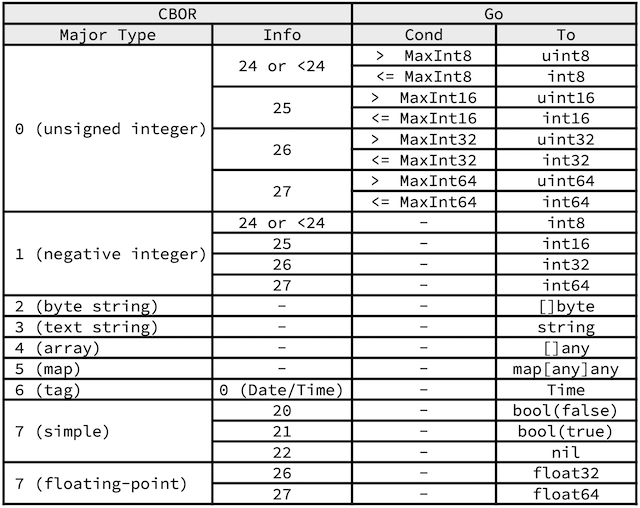
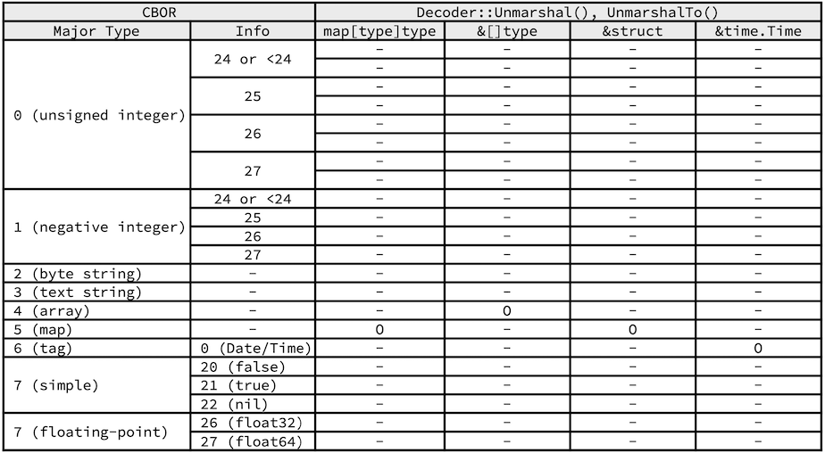

# go-cbor


[](https://github.com/cybergarage/go-cbor/actions/workflows/make.yml)
[](https://pkg.go.dev/github.com/cybergarage/go-cbor)

`go-cobor` provides encoders and decoders for Concise Binary Object Representation (CBOR) binary representations. CBOR is defined in RFC8949, and it is a data format whose design goals include the possibility of extremely small code size, fairly small message size, and extensibility without the need for version negotiation.

`go-cobor` was developed as a seamless serializer for the memory representation of any data types in Go like `encodiong/json`. `go-cobor` provides the optimized encoder and decoder to convert between CBOR and Go data models easily.

Although CBOR is designed for very small code size and fairly small message size, `go-cobor` encodes the specified data model without downgrading the data type to ensure seamless data model compatibility when decoding the encoded data.

## Converting Data between Go and CBOR

`go-cobor` was developed as a seamless serializer for the memory representation of any data types in Go like `encodiong/json`. `go-cobor` provides the optimized encoder and decoder to convert between CBOR and Go data models easily.


This section describes how go-cobor` converts data model between Go and CBOR in more detail.

### Encoding - Converting from Go to CBOR

`Decoder::Decode()` and `Marshal()` convert from the specified data model of Go into the equivalent data model of CBOR as the following.


To convert data from Go to CBOR, `go-cbor` offers `Marshal()`. `Marshal()` converts from the specified data model of Go into the equivalent data model of CBOR as the following.

```
goObjs := []any{
    uint(1000),
    int(-1000),
    float32(100000.0),
    float64(-4.1),
    false,
    true,
    nil,
    []byte("IETF"),
    "IETF",
    []int{1, 2, 3},
    map[any]any{"a": "A", "b": "B", "c": "C"},
}
for _, goObj := range goObjs {
    cborBytes, _ := cbor.Marshal(goObj)
    fmt.Printf("%v => %s\n", goObj, hex.EncodeToString(cborBytes))
}
```

In addition to the basic Go data types, `go-cbor` supports additional tag major types such as `time.Time` as the following.

```
goObj, _ := time.Parse(time.RFC3339, "2013-03-21T20:04:00Z")
cborBytes, _ := cbor.Marshal(goObj)
fmt.Printf("%v => %s\n", goObj, hex.EncodeToString(cborBytes))
```

### Decoding - Converting from CBOR to Go

`Decoder::Decode()` and `Unmarshal()` convert from the specified data model of CBOR into the equivalent data model of Go as the following.



To convert data from CBOR to Go, `go-cbor` offers `Unmarshal()`. `Unmarshal()` converts from an encoded bytes of CBOR into the equivalent data model of Go as the following.

```
cborObjs := []string{
    "0a",
    "1903e8",
    "3903e7",
    "fb3ff199999999999a",
    "f90001",
    "f4",
    "f5",
    "f6",
    "c074323031332d30332d32315432303a30343a30305a",
    "4449455446",
    "6449455446",
    "83010203",
    "a201020304",
}
for _, cborObj := range cborObjs {
    cborBytes, _ := hex.DecodeString(cborObj)
    goObj, _ := cbor.Unmarshal(cborBytes)
    fmt.Printf("%s => %v\n", cborObj, goObj)
}
```

### Unmarshaling from CBOR to Go

To unmarshal to a user-defined struct, `go-cbor` offers `Decoder::Unmarshal()` and `UnmarshalTo()`. The unmarshal functions try to convert from an encoded bytes of CBOR into the specified basic data types of Go as the following.


In addition to the basic standard data types of Go, The unmarshal functions support any user-defined maps and structs, as well as the standard struct such as time.Time as the following.



To unmarshal to a user-defined struct, `go-cbor` offers `UnmarshalTo()`. `Unmarshal()To` tries to convert from an encoded bytes of CBOR into the specified user-defined struct or map as the following.

```
fromObjs := []any{
    struct {
        Key   string
        Value string
    }{
        Key: "hello", Value: "world",
    },
    map[string]int{"one": 1, "two": 2},
}

toObjs := []any{
    &struct {
        Key   string
        Value string
    }{},
    map[string]int{},
}

for n, fromObj := range fromObjs {
    toObj := toObjs[n]
    encBytes, _ := cbor.Marshal(fromObj)
    cbor.UnmarshalTo(encBytes, toObj)
}
```

## Examples

- [go-cbor module - github.com/cybergarage/go-cbor - Go Packages](https://pkg.go.dev/github.com/cybergarage/go-cbor)

## References

- [CBOR — Concise Binary Object Representation](http://cbor.io)
