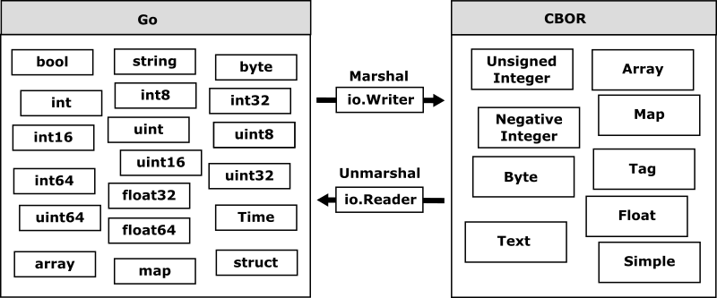

# Converting Data between Go and CBOR

`go-cobor` was developed as a seamless sirializer for the memor representation of any data types in Go like `encodiong/json`. `go-cobor` provides the optimized encoder and decoder to convert between CBOR and Go data models easily.

This section describes how go-cobor` converts data model between Go and CBOR in more detail.

## Converting from Go to CBOR

`Decoder::Decode()` and `Marshal()` convert from the specified data model of Go  into the equivalent data model of CBOR as the following.

Although CBOR is designed for very small code size and fairly small message size, `go-cobor` encodes the specified data model without downgrading the data type to ensure seamless data model compatibility when decoding the encoded data.

## Converting from CBOR to Go

`Decoder::Decode()` and `Unmarshal()` convert from the specified data model of CBOR into the equivalent data model of Go as the following.

In addition to the basic CBOR measure types, `go-cbor` supports additional tag measure types such as datetime.