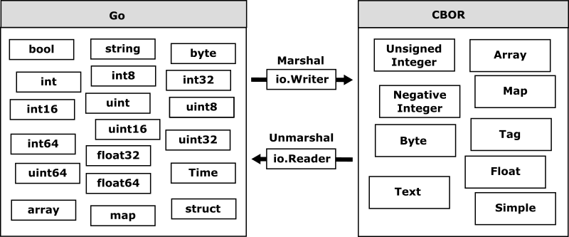

# Overview

`go-cobor` provides encoders and decoders for Concise Binary Object Representation (CBOR) binary representations. CBOR is defined in RFC8949, and it is a data format whose design goals include the possibility of extremely small code size, fairly small message size, and extensibility without the need for version negotiation.

`go-cobor` was developed as a seamless serializer for the memory representation of any data types in Go like `encodiong/json`. `go-cobor` provides the optimized encoder and decoder to convert between CBOR and Go data models easily.

Although CBOR is designed for very small code size and fairly small message size, `go-cobor` encodes the specified data model without downgrading the data type to ensure seamless data model compatibility when decoding the encoded data.

## Table of Contents

- [Quick Start](overview.md)
- Inside of go-cbor
  - [Converting Data between Go and CBOR](conversion.md)

## References

- [CBOR — Concise Binary Object Representation](http://cbor.io)
